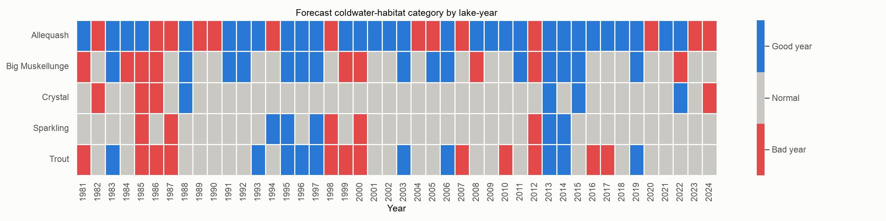
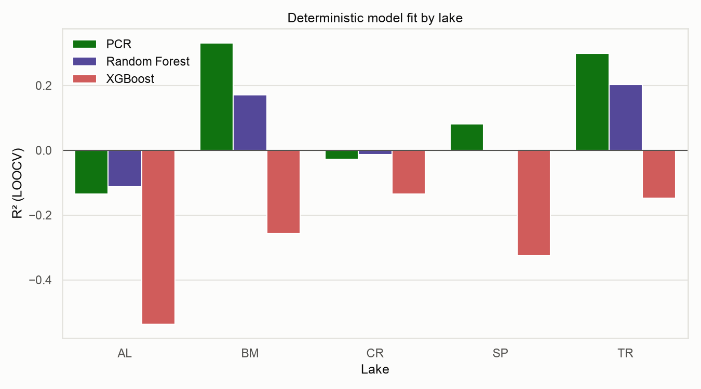
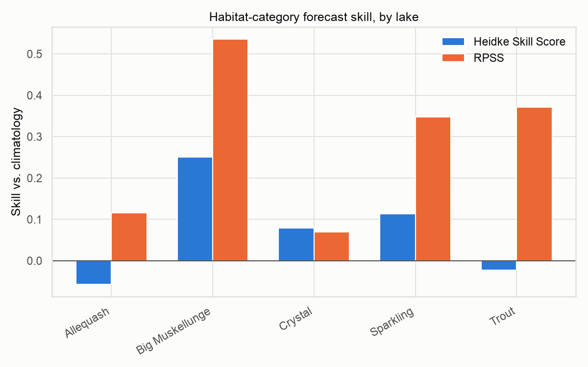

# Lake Coldwater Habitat Modeling

Modeling and forecasting **coldwater fish habitat** in five North Temperate
Lakes (NTL-LTER, Wisconsin) — Allequash, Big Muskellunge, Crystal, Sparkling,
and Trout — from ~40 years of climate and limnology data.

The core metric, **CVHT** (cumulative volumetric habitat thickness), captures
the depth range in a lake where temperature ≤ 17°C *and* dissolved oxygen ≥
3 mg/L: the refuge zone coldwater fish need to survive a warming summer. This
project asks two questions of that metric:

1. **Can it be predicted** from climate indices (ENSO/MEI, wind, geopotential
   height) and local limnology (nutrients, chlorophyll, ice duration, lake
   level)?
2. **Can a given year be classified** as a good, normal, or bad year for
   coldwater habitat — and how much better than a naive guess is that
   classification?

The original analysis was built in R (data wrangling, `tidymodels` regression,
poster figures). [`python/`](python/) is a from-scratch Python port of the
modeling pipeline — deterministic regression, a probabilistic good-year/
bad-year forecast layer, and interactive + static visualizations — written to
be run and read end-to-end as Jupyter notebooks.

## Good year vs. bad year, at a glance



Each cell is one lake-year, colored by forecast habitat category: **blue** =
good coldwater-habitat year (top third historically), **gray** = normal,
**red** = bad year (bottom third). See
[`03_good_bad_year_forecast.ipynb`](python/notebooks/03_good_bad_year_forecast.ipynb)
for the full methodology and per-lake forecast skill scores.

## Repository structure

```
.
├── *.R, *.r                     # Original R analysis (data prep -> models -> validation -> figures)
├── *.csv                        # Raw NTL-LTER data, predictor tables, model outputs
├── *.png                        # R-generated poster/report figures
├── python/
│   ├── notebooks/
│   │   ├── 01_data_overview.ipynb            # CVHT by lake, coverage, distributions
│   │   ├── 02_deterministic_models.ipynb     # PCR / Random Forest / XGBoost, per-lake LOOCV
│   │   └── 03_good_bad_year_forecast.ipynb   # Residual-ensemble good/bad-year classifier + skill scores
│   ├── src/                     # Shared modules the notebooks import (data, models, probabilistic, viz)
│   ├── figures/                 # Static PNGs exported from the notebooks
│   ├── outputs/                 # CSV exports (predictions, scores, forecasts) from the Python pipeline
│   └── requirements.txt
└── CLAUDE.md                     # Notes on the R pipeline's structure and quirks
```

See [`CLAUDE.md`](CLAUDE.md) for a detailed walkthrough of the R pipeline
(what each numbered script does, and which experimental scripts are dead
ends).

## Python pipeline

```bash
cd python
python3 -m venv .venv && source .venv/bin/activate
pip install -r requirements.txt
jupyter notebook notebooks/
```

**[`01_data_overview.ipynb`](python/notebooks/01_data_overview.ipynb)** — loads
the master lake-year table and visualizes how CVHT has moved over time and how
its distribution differs by lake.

**[`02_deterministic_models.ipynb`](python/notebooks/02_deterministic_models.ipynb)**
— for each lake independently: median-impute predictors, drop zero-variance
columns, standardize, reduce to 3 principal components, then fit PCR, Random
Forest, and XGBoost with leave-one-out cross-validation (refitting the whole
pipeline per held-out year, so nothing leaks across folds).



**[`03_good_bad_year_forecast.ipynb`](python/notebooks/03_good_bad_year_forecast.ipynb)**
— takes each lake's best deterministic model, fits a normal distribution to
its residuals, and draws a 100-member ensemble per lake-year to turn a point
prediction into a probabilistic forecast of habitat category (tercile-based:
Below Normal / Near Normal / Above Normal). Scores those forecasts against a
naive climatology baseline with the Heidke Skill Score and Ranked Probability
Skill Score.



Most lakes forecast better than climatology (Big Muskellunge strongest); a
couple are roughly break-even — a reminder that ~40 samples per lake is a
small-sample regime, not a production forecasting system.

## Data sources

- North Temperate Lakes LTER physical limnology, chemistry, chlorophyll, lake
  level, and ice datasets ([EDI/PASTA](https://pasta.lternet.edu), NTL-LTER
  packages 29, 1, 35, 30, 32).
- Global climate indices (MEI, Niño 4, ONI) and reanalysis fields (wind,
  geopotential height) merged in as predictors.
